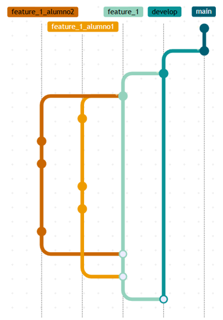

# Herramientas de Programación
Ejercicio clase de Herramientas de Programación MUDS 2025-26

   
El ejercicio está pensado para grupos de 2 personas (cada persona con su ordenador) – Alumno1 y Alumno2

 

## <u>Preparación</u>   
El Alumno1 hará un Fork del repositorio, luego los dos lo clonaran del repositorio remoto del Alumno1 (no del enunciado).  
El repositorio tiene 3 ramas, _main_, _dev_ y _feature\_1_. Ambos alumnos deben ir a la rama _feature\_1_ y crear una rama para trabajar (por ejemplo: _feature\_1\_alumno1_ y _feature\_1\_alumno2_).

 

## <u>Tarea</u>  
El Alumno1 debe hacer que el algoritmo **Bubble Sort** ordene el array de manera ascendente, el Alumno2 debe hacer que lo haga descendente.  
Como se puede ver, el código original no funciona nada bien, se debe arreglar con el debugger.  
Una vez funcionen los dos códigos se hará pull request de la primera rama hacia feature_1, después se hará otro pull request hacia feature_1 con la segunda rama (en los dos casos se tiene que poner como revisor al otro miembro del grupo).  
Intentar hacer múltiples commits por persona

 

## <u>Ejemplo de estructura de Git</u>  

Ejemplo de como estructura de como debería quedar el árbol: 
  

    

